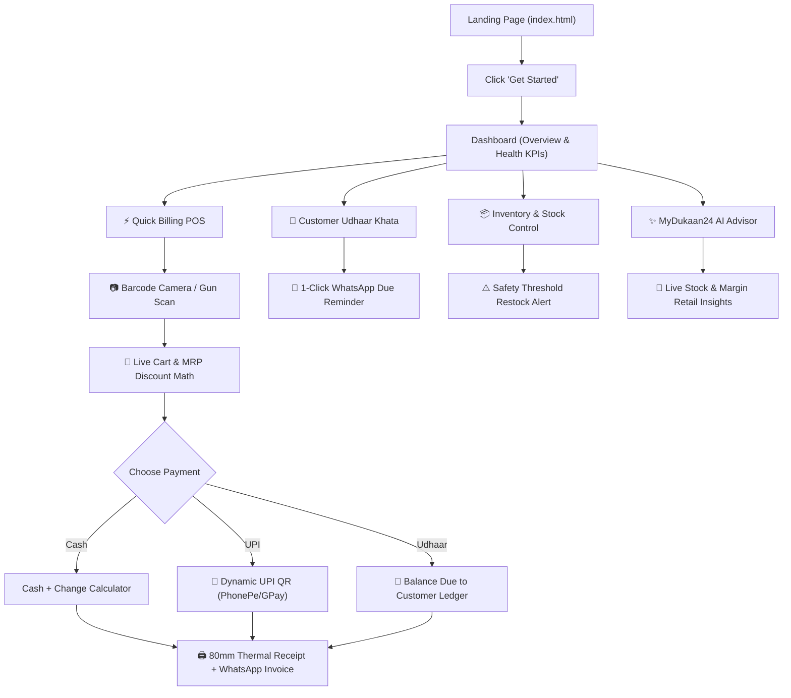

# ⚡ MyDukaan24 — Modern Retail Business OS & Smart POS


> **"Your shop. Your data. Your business, simplified."**  
> A startup-grade, modern retail operating system & POS terminal engineered for Indian Kirana stores, supermarkets, and local businesses.  
> **Lead Architect & Creator:** [Mayur Singh](https://linkedin.com/in/mayursingh24) (Lucknow, Uttar Pradesh, India) 🇮🇳

---

## 📖 Table of Contents
- [🌟 What is MyDukaan24?](#-what-is-mydukaan24)
- [✨ Key Features & Modules](#-key-features--modules)
- [🎮 Interactive Kirana POS Playground](#-interactive-kirana-pos-playground)
- [📷 Universal Barcode & Hardware Scanner](#-universal-barcode--hardware-scanner)
- [🤖 Real Online AI (Google Gemini 3.8 Flash)](#-real-online-ai-google-gemini-38-flash)
- [💾 Inbuilt Zero-Setup Local Database](#-inbuilt-zero-setup-local-database)
- [📱 Dynamic UPI QR & Thermal Invoicing](#-dynamic-upi-qr--thermal-invoicing)
- [📒 Digital Udhaar Khata & WhatsApp CRM](#-digital-udhaar-khata--whatsapp-crm)
- [🛠️ Tech Stack & Architecture](#️-tech-stack--architecture)
- [📁 Clean File Structure](#-clean-file-structure)
- [🚀 Quick Start & Local Setup](#-quick-start--local-setup)
- [🌐 Netlify Production Deployment](#-netlify-production-deployment)
- [🔄 Complete User Workflow](#-complete-user-workflow)
- [👨‍💻 Developer & Contact Info](#-developer--contact-info)

---

## 🌟 What is MyDukaan24?

**MyDukaan24** is a modern, privacy-focused, offline-first SaaS Business OS designed to empower small Indian retail businesses and eliminate:
- ❌ **Torn paper Udhaar notebooks** where customer debts get forgotten or disputed.
- ❌ **Slow manual billing queues** during evening rush hours.
- ❌ **Stockout surprises** on high-demand essentials (Atta, Dal, Oil, Milk).
- ❌ **Complicated, expensive enterprise POS software** that requires external cloud database setup, high subscription fees, and dedicated IT staff.

MyDukaan24 works **out-of-the-box in any modern browser** on mobile phones, tablets, laptops, and desktop billing terminals. It requires **zero database installation** and functions with 100% reliability even if the shop's internet goes down.

---

## ✨ Key Features & Modules

### 1. ⚡ High-Speed POS Billing Terminal
- Generate complete itemized invoices in **under 5 seconds**.
- Multi-mode payment tenders: **Cash** (with automated change-return calculator), **UPI** (with instant dynamic QR code), **Card**, and **Udhaar (Customer Credit)**.
- Real-time cart calculations: subtotal, MRP discount savings, customizable GST tax rates, and overall bill discounts (% or ₹).
- Zero-latency audio feedback via the Web Audio API with realistic supermarket scanner beeps and cash register chimes.

### 2. 📷 Universal Barcode Scanner & MRP Vision
- **Cross-Browser Camera Scanning:** Dual engine using `Html5Qrcode` CDN + native browser `BarcodeDetector` API.
- **Hardware Scanner Gun Support:** Global keyboard event listener that auto-detects USB/Bluetooth handheld barcode guns without requiring input focus.
- Automatically recognizes EAN-13, EAN-8, Code-128, and QR codes, matching item name, MRP, selling price, and real-time inventory count.

### 3. 📦 Inventory & Stock Threshold Control
- Full product catalog management with SKU identifiers, categories, cost prices, MRPs, and profit margins.
- Automated safety stock alerts: contextual warning banners for **Low Stock** and **Out of Stock** items.
- Quick 1-click restock adjustments and inline editing.

### 4. 📒 Customer Udhaar Khata (Credit Ledger)
- Digital ledger tracking individual customer credit dues, purchase history, and loyalty reward points (Bronze, Silver, Gold tiers).
- **1-Click Polite WhatsApp Reminders:** Generates pre-formatted WhatsApp payment links containing the customer's exact balance due and the shop's UPI ID.
- Cash/UPI debt settlement modal that updates customer balance in real time.

### 5. 🧾 Thermal Receipts & WhatsApp Invoices
- Print-ready **80mm standard thermal receipts** styled for POS receipt printers.
- One-click digital invoice sharing to customer WhatsApp numbers without saving numbers in contacts.

### 6. 👔 Employee Directory & 31-Day Attendance
- Staff directory for store helpers, billing cashiers, and delivery staff with contact and salary records.
- Interactive 31-day monthly attendance grid: Click any date to cycle between **Present (Green)**, **Half-Day (Yellow)**, and **Absent (Red)**.
- Automated monthly payroll estimations.

### 7. 📈 Financial Analytics & Profit/Loss (P&L) Statement
- Interactive SVG 7-day revenue trend chart.
- Real-time Cost of Goods Sold (COGS) and Operating Expenses breakdown (Rent, Electricity, Freight, Salaries).
- Net take-home profit margin calculation:  
  $$\text{Net Profit} = \text{Gross Revenue} - \text{COGS} - \text{Operating Expenses}$$

### 8. ✨ MyDukaan24 AI — Real Online Retail Brain
- Integrated with **Google Gemini 3.8 Flash** (`gemini-3.8-flash` with automatic fallback to `gemini-2.5-flash` / `gemini-1.5-flash`).
- Contextually grounded in your shop's live data: real-time inventory, stockouts, top debtors, and revenue are dynamically provided to the model.
- Solves real retail questions:
  - *"Which products are low in stock and need reordering before tomorrow?"*
  - *"Who owes me the most money in pending Udhaar?"*
  - *"What are 3 practical ways I can increase my profit margin this month?"*
  - *"Draft a polite WhatsApp reminder message for customers with pending dues."*

---

## 🎮 Interactive Kirana POS Playground

The landing page (`index.html`) features a **Live Interactive Kirana Terminal Simulator**:
- **Clickable Kirana Shelf:** Includes authentic FMCG products (Aashirvaad Atta, Fortune Oil, Amul Butter, Tata Tea, Surf Excel, Cadbury Silk).
- **Web Audio Sound Effects:** Real supermarket scanner beeps (`1850Hz`) when clicking items, and cash register chimes upon checkout.
- **Dynamic Active Cart:** Watch items enter the bill with quantity controls, live MRP savings calculations, and subtotal updates.
- **Simulate Barcode Gun:** Click to trigger an animated red laser beam sweep that scans products automatically.
- **Simulate UPI Payment:** Opens a live dynamic UPI QR code modal with PhonePe/GPay badges and a payment confirmation simulation.
- **80mm Thermal Slip:** Slide down an authentic receipt slip with store header and itemized breakdown.

---

## 📷 Universal Barcode & Hardware Scanner

MyDukaan24 eliminates hardware lock-in by providing a 3-tier barcode scanning architecture:

```
[Hardware / Camera Input]
       │
       ├── Tier 1: USB / Bluetooth Handheld Barcode Guns (Rapid keybuffer listener)
       │
       ├── Tier 2: Universal Camera Stream via Html5Qrcode Library (Mobile & Desktop)
       │
       └── Tier 3: Native Browser BarcodeDetector API (High-performance hardware acceleration)
```

- **Supported Formats:** EAN-13, EAN-8, UPC-A, UPC-E, Code-128, Code-39, and QR Code.
- **Shortcuts:** Press `Ctrl + K` anywhere in the app to instantly open the camera barcode scanner.

---

## 🤖 Real Online AI (Google Gemini 3.8 Flash)

MyDukaan24 provides a **hybrid AI architecture** for maximum flexibility and security:

1. **Option A: In-App API Key Entry (Zero Configuration)**
   - Open MyDukaan24 → Click **✨ MyDukaan AI** or go to **Settings**.
   - Enter your free Google Gemini API key from [aistudio.google.com](https://aistudio.google.com).
   - Saved locally in your browser with zero server setup.
2. **Option B: Secure Serverless Backend Proxy (Netlify Functions)**
   - Client sends prompt to `/api/gemini` (handled by `netlify/functions/gemini.js`).
   - Serverless function retrieves `GEMINI_API_KEY` from Netlify Environment Variables.
   - Zero API key exposure to client-side network traffic.

### Resilient Multi-Model Fallback
Both backend and client engines implement automatic multi-model resolution:
`gemini-3.8-flash` ➔ `gemini-2.5-flash` ➔ `gemini-1.5-flash` to ensure 100% uptime regardless of API tier.

---

## 💾 Inbuilt Zero-Setup Local Database

Per user specifications, **external databases (such as Firebase or MongoDB) were deliberately removed**:
- **100% Offline & Private:** Your financial records, customer phone numbers, and profit margins never leave your device.
- **Zero Latency:** Database transactions occur in under 1 millisecond.
- **Storage Engine:** High-performance browser persistence via `localStorage` with structured schema and seed Kirana data.
- **Data Portability:** 1-click CSV export for Tally/Excel and full JSON backup/restore from the Settings view.

---

## 📱 Dynamic UPI QR & Thermal Invoicing

- Generates instant UPI payment strings compliant with NPCI standards:
  `upi://pay?pa={UPI_ID}&pn={STORE_NAME}&am={AMOUNT}&cu=INR`
- Scannable with **PhonePe, Google Pay, Paytm, BHIM, Amazon Pay**, and all major banking apps.
- Print receipts formatted to standard **80mm (3-inch)** thermal paper dimensions.

---

## 📒 Digital Udhaar Khata & WhatsApp CRM

- Track customer credit balances with color-coded status badges:
  - 🟢 **₹0 (Clear)**
  - 🟡 **₹1 - ₹1,000 (Low Due)**
  - 🔴 **₹1,000+ (High Due)**
- **WhatsApp Reminder Generation:** Automatically strips non-digits from customer phone numbers (`+91` normalization) and generates direct `https://wa.me/` links containing polite Hindi/English payment reminder messages.

---

## 🛠️ Tech Stack & Architecture

| Layer | Technology |
|---|---|
| **Frontend Framework** | Modular Vanilla JavaScript (ES6+ Classes), Zero Bloat |
| **Styling & System** | Custom CSS3 Design System (Obsidian Slate `#07090E` & Electric Indigo `#6366F1`) |
| **Typography** | `Outfit` (Headings & Badges), `Inter` (Body & Controls), `JetBrains Mono` (Financials) |
| **Audio Engine** | Web Audio API Oscillator & Gain Synthesizer |
| **Vision Scanner** | `Html5Qrcode` CDN + Native `BarcodeDetector` + USB Gun Listener |
| **Generative AI** | Google Gemini 3.8 Flash (`generativelanguage.googleapis.com`) |
| **Backend Functions** | Netlify Serverless Functions (`netlify/functions/gemini.js`) |
| **PWA & Offline** | Web App Manifest + Service Worker (`sw.js`) |
| **Hosting & CI/CD** | Netlify Production Hosting with Continuous Deployment from GitHub |

---

## 📁 Clean File Structure

```
MyDukaan/
├── index.html                 ← SaaS Landing Page & Interactive Kirana Playground
├── app.html                   ← Full Business OS & POS Terminal Application
├── manifest.json              ← Progressive Web App Manifest
├── sw.js                      ← Offline Service Worker & Caching Engine
├── netlify.toml               ← Netlify Serverless & Build Configuration
├── _redirects                 ← Netlify SPA URL Rewrites
├── .env.example               ← Example Environment Configuration
├── .gitignore                 ← Git Exclusion Rules
├── README.md                  ← Comprehensive Product Documentation
├── netlify/
│   └── functions/
│       └── gemini.js          ← Resilient Serverless Proxy for Gemini 3.8 Flash
├── css/
│   ├── style.css              ← Design System, Variables, Layout, Dual-Theme
│   ├── components.css         ← POS Grid, Scanner Reticle, Modals, Receipt Print
│   └── landing.css            ← Bento Grid, Spotlight Hover, Border Shimmers
└── js/
    ├── storage.js             ← Inbuilt Local Database & Audio Synthesizer
    ├── scanner.js             ← Universal Camera Vision & Hardware Scanner Engine
    ├── pos.js                 ← Quick Billing POS, Cart Math, UPI QR, Receipts
    ├── inventory.js           ← Catalog Management & Safety Stock Thresholds
    ├── khata.js               ← Customer Udhaar Ledger & 1-Click WhatsApp Reminders
    ├── analytics.js           ← SVG Trend Charts & Cost of Goods Sold P&L Engine
    ├── staff.js               ← Staff Directory & 31-Day Interactive Attendance Grid
    ├── ai.js                  ← Online Gemini 3.8 Flash Intelligence Engine
    └── app.js                 ← UI Router, Animated KPI Counters & Settings
```

---

## 🚀 Quick Start & Local Setup

Because MyDukaan24 is built with clean web standards, it requires **no node modules, npm installs, or complex toolchains**:

1. **Clone the repository:**
   ```bash
   git clone https://github.com/mayursingh24/MyDukaan.git
   cd MyDukaan
   ```
2. **Open directly in your browser:**
   - Double-click `index.html` to explore the Landing Page & Simulator.
   - Double-click `app.html` to launch the POS & Store OS terminal.
3. *(Optional)* Serve locally with any static web server:
   ```bash
   # Python
   python -m http.server 8080
   
   # Or Node.js
   npx serve .
   ```

---

## 🌐 Netlify Production Deployment

### Method 1: Instant Drag & Drop (30 Seconds)
1. Download or use the pre-packaged zip archive: `MyDukaan24-Deploy.zip`
2. Navigate to **[app.netlify.com/drop](https://app.netlify.com/drop)**
3. Drag and drop `MyDukaan24-Deploy.zip` into the browser window.
4. Netlify will instantly deploy your site and provide a live URL!

### Method 2: GitHub Auto-Deploy (Recommended for CI/CD)
1. Push your repository to GitHub (`main` branch).
2. Go to **Netlify Dashboard** → **Add new site** → **Import an existing project**.
3. Select **GitHub** and authorize repository **`mayursingh24/MyDukaan`**.
4. Configure build settings:
   - **Base directory:** Leave blank
   - **Build command:** Leave blank
   - **Publish directory:** `.` (root)
   - **Functions directory:** `netlify/functions`
5. *(Optional)* Add your Gemini API key in **Site configuration → Environment variables**:
   - `GEMINI_API_KEY = your_google_gemini_key_here`
6. Click **Deploy MyDukaan**. Every new commit will automatically auto-deploy in seconds!

---

## 🔄 Complete User Workflow



---

## 👨‍💻 Developer & Contact Info

- **Lead Creator & Deployer:** **Mayur Singh**
- **Location:** Lucknow, Uttar Pradesh, India 🇮🇳
- **Email:** [mayur4singhhh@gmail.com](mailto:mayur4singhhh@gmail.com)
- **Instagram:** [@_mayur.x24](https://instagram.com/_mayur.x24)
- **LinkedIn:** [mayursingh24](https://linkedin.com/in/mayursingh24)
- **GitHub:** [@mayursingh24](https://github.com/mayursingh24)

---

*Engineered with precision for the hardworking shopkeepers of India.* 🇮🇳
